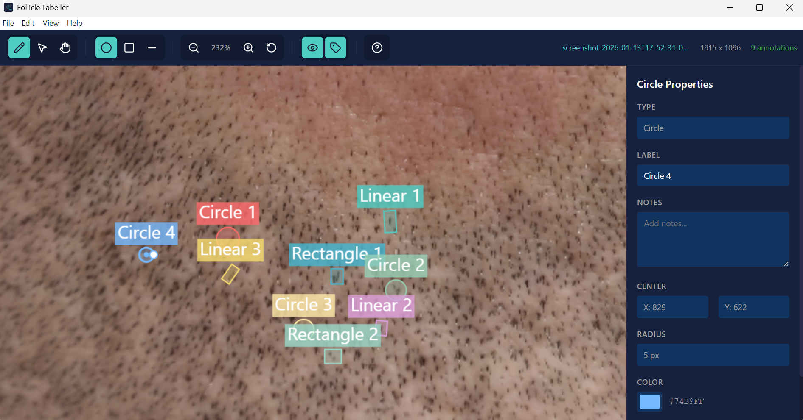

# Follicle Labeller

[](https://github.com/blockchainadvisors/follicle-labeller/actions/workflows/build.yml)
[](https://github.com/blockchainadvisors/follicle-labeller/releases/latest)
[](https://github.com/blockchainadvisors/follicle-labeller/releases)

A desktop application for medical image annotation, specifically designed to label and annotate hair follicles in medical/healthcare images. Built with Electron, React, and TypeScript.



## Download

Download the latest version for your platform:

| Platform | Download |
|----------|----------|
| **Windows** | [**Download Installer**](https://github.com/blockchainadvisors/follicle-labeller/releases/latest/download/follicle-labeller-windows-latest.exe) |
| **macOS** | [**Download DMG**](https://github.com/blockchainadvisors/follicle-labeller/releases/latest/download/follicle-labeller-macos-latest.dmg) |

See [all releases](https://github.com/blockchainadvisors/follicle-labeller/releases) for previous versions.

## Features

### Annotation Tools
- **Circle** - Simple circular annotations with center point and radius
- **Rectangle** - Rectangular annotations with position and dimensions
- **Linear** - Rotated rectangles defined by centerline and half-width (ideal for elongated structures)

### Interaction Modes
- **Create Mode** - Draw new annotations on the image
- **Select Mode** - Select, move, and resize existing annotations
- **Pan Mode** - Navigate around the canvas

### Annotation Properties
- Customizable labels and notes for each annotation
- Color customization per annotation
- Automatic sequential naming (Circle 1, Circle 2, etc.)
- View coordinates, dimensions, radius, and angle information

### Navigation
- Zoom in/out with mouse wheel (0.1x to 10x scaling)
- Pan with middle mouse button (works in any mode)
- Zoom-to-fit and reset zoom options
- Real-time zoom percentage display

### File Operations
- Open image files (PNG, JPG, JPEG, TIFF, BMP, WebP)
- Save projects as `.fol` archives (contains both image and annotations)
- Load previously saved `.fol` project files
- Annotations stored in JSON format

### Undo/Redo
- Full undo/redo support with 50-level history
- Keyboard shortcuts (Ctrl+Z, Ctrl+Shift+Z)

### Help & Documentation
- Built-in user guide accessible via Help button or `?` key
- Comprehensive documentation covering all features

## Installation

### Prerequisites
- Node.js 18+
- npm or yarn

### Setup
```bash
# Clone the repository
git clone <repository-url>
cd label-for-llm

# Install dependencies
npm install
```

## Development

```bash
# Start development server with hot reload
npm run dev

# Run Electron in development mode
npm run electron:dev

# Type checking
npm run typecheck
```

## Building

```bash
# Build the application
npm run build

# Build and package for distribution
npm run electron:build
```

The packaged application will be available in the `release` directory.

### Supported Platforms
- Windows (NSIS installer)
- macOS (DMG)
- Linux (AppImage)

## Usage

### Creating Annotations

1. Open an image using **File > Open Image** or the toolbar button
2. Select a shape type from the toolbar (Circle, Rectangle, or Linear)
3. Click **Create** mode (or press `C`)
4. Click and drag on the image to draw the annotation
   - **Circle**: Drag from center outward
   - **Rectangle**: Drag from corner to opposite corner
   - **Linear**: Click to set the first endpoint, click again for the second endpoint, then click to set the width

### Editing Annotations

1. Switch to **Select** mode (or press `V`)
2. Click on an annotation to select it
3. Drag the center to move the annotation
4. Drag the handles to resize
5. Use the Property Panel on the right to edit label, notes, and color

### Saving and Loading

- **Save**: Saves the current image and all annotations as a `.fol` archive
- **Load**: Opens a previously saved `.fol` file
- The `.fol` format is a ZIP archive containing the original image and `annotations.json`

## Keyboard Shortcuts

| Key | Action |
|-----|--------|
| `C` | Create mode |
| `V` | Select mode |
| `H` | Pan mode |
| `1` | Circle shape |
| `2` | Rectangle shape |
| `3` | Linear shape |
| `L` | Toggle labels visibility |
| `O` | Toggle shapes visibility |
| `?` | Toggle help panel |
| `Delete` / `Backspace` | Delete selected annotation |
| `Ctrl+Z` | Undo |
| `Ctrl+Shift+Z` | Redo |
| `Ctrl+Tab` | Next image |
| `Ctrl+Shift+Tab` | Previous image |
| `Escape` | Deselect / Cancel operation |
| `Middle Mouse` | Pan (in any mode) |
| `Scroll Wheel` | Zoom in/out |

## Project Structure

```
├── src/
│   ├── main.tsx                 # React entry point
│   ├── App.tsx                  # Main app component
│   ├── types/
│   │   └── index.ts             # TypeScript type definitions
│   ├── components/
│   │   ├── Canvas/
│   │   │   ├── ImageCanvas.tsx  # Main canvas with interaction handling
│   │   │   └── CanvasRenderer.ts# Canvas rendering logic
│   │   ├── Toolbar/
│   │   │   └── Toolbar.tsx      # Top toolbar component
│   │   └── PropertyPanel/
│   │       └── PropertyPanel.tsx# Right sidebar for editing properties
│   ├── store/
│   │   ├── follicleStore.ts     # Annotation state management
│   │   └── canvasStore.ts       # Viewport and settings state
│   └── utils/
│       ├── export-utils.ts      # JSON export/import utilities
│       ├── coordinate-transform.ts # Coordinate conversion
│       └── id-generator.ts      # UUID generation
├── electron/
│   ├── main.ts                  # Electron main process
│   └── preload.ts               # Electron preload script
├── index.html                   # HTML entry point
├── package.json                 # Dependencies and scripts
├── tsconfig.json                # TypeScript configuration
├── vite.config.ts               # Vite build configuration
└── electron-builder.json5       # Electron packaging config
```

## Tech Stack

- **Frontend**: React 18, TypeScript 5.3
- **State Management**: Zustand with Zundo (undo/redo)
- **Desktop Framework**: Electron 28
- **Build Tool**: Vite 5
- **Rendering**: HTML5 Canvas 2D API with ImageBitmap optimization
- **Archive Format**: JSZip for `.fol` project files

## File Format

### .fol Archive Structure
The `.fol` file is a ZIP archive containing:
- `image.<ext>` - The original image file
- `annotations.json` - Serialized annotation data

### Annotation JSON Schema
```json
{
  "id": "uuid",
  "type": "circle" | "rectangle" | "linear",
  "label": "string",
  "notes": "string",
  "color": "#hexcolor",
  "x": "number (center x)",
  "y": "number (center y)",
  "radius": "number (circle only)",
  "width": "number (rectangle/linear)",
  "height": "number (rectangle only)",
  "halfWidth": "number (linear only)",
  "angle": "number (linear only, radians)"
}
```

## License

This project is licensed under the MIT License - see the [LICENSE](LICENSE) file for details.

## Contributing

This project was created and is maintained by [@LorenzoNey](https://github.com/LorenzoNey).

Contributions are welcome! If you'd like to contribute:

1. Fork the repository
2. Create a feature branch (`git checkout -b feature/amazing-feature`)
3. Commit your changes (`git commit -m 'Add some amazing feature'`)
4. Push to the branch (`git push origin feature/amazing-feature`)
5. Open a Pull Request

## Author

**LorenzoNey** - *Initial work and maintenance* - [@LorenzoNey](https://github.com/LorenzoNey)
